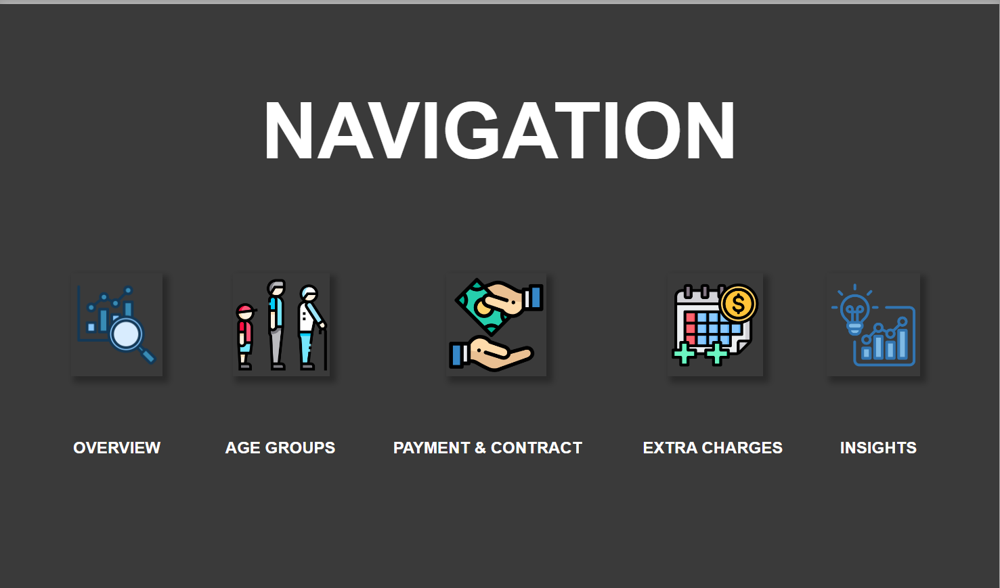
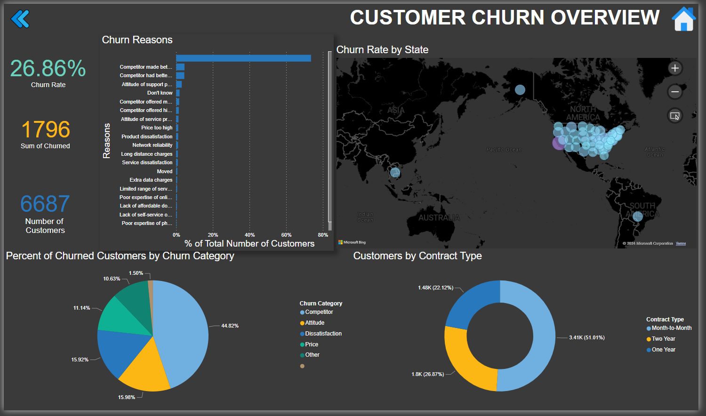

# Analyzing Customer Churn in Power BI

This repository contains my solution for the DataCamp case study "Analyzing Customer Churn in Power BI". In this project, I delved into a dataset from the fictional telecom company Databel and conducted an in-depth analysis of their customer churn rates.

## Project Overview

The primary objective of this project was to investigate the factors contributing to customer churn within Databel and provide actionable insights to reduce churn rates. Leveraging Power BI, I crafted an engaging and comprehensive report that sheds light on why customers are churning at their current rate and proposes strategies to mitigate churn effectively.

## Contents

- **Data Exploration**: I conducted exploratory data analysis (EDA) to understand the dataset's structure, identify patterns, and unveil insights into customer behavior.
- **Churn Analysis**: Using various visualizations and analytical tools in Power BI, I analyzed churn rates, identified key churn drivers, and segmented customers based on their churn behavior.
- **Insights & Recommendations**: The report includes actionable insights and strategic recommendations aimed at reducing churn and improving customer retention for Databel.
  
## File Structure

The repository is structured as follows:
- `Data/`: Contains the dataset used for analysis.
- `Reports/`: Includes the Power BI report file (`Churn_Analysis_Report.pbix`) and any related documentation.
- `README.md`: This file, providing an overview of the project.

## Key Tools and Technologies Used

- **Power BI**: Utilized for data visualization, analysis, and report generation.
- **Python**: Potential usage for data preprocessing (if applicable), though this analysis primarily focused on Power BI.
- **Git**: Version control system for managing project iterations and collaboration.

## How to Access the Power BI Report

The Power BI report file (`Churn_Analysis_Report.pbix`) can be accessed in the `Reports/` directory. To view the report, ensure you have Power BI Desktop installed. Simply open the file in Power BI Desktop to interact with the visualizations, explore the analysis, and delve deeper into the insights presented.

## Snap:
### Navigation Menu

### DashBoard

## Conclusion

Kindly Read Report.MD

This case study presents a detailed examination of customer churn in Databel, offering valuable insights and actionable recommendations to help the company strategize and reduce churn rates effectively.

Feel free to reach out for any clarifications or additional information regarding this analysis.

Happy analyzing!
